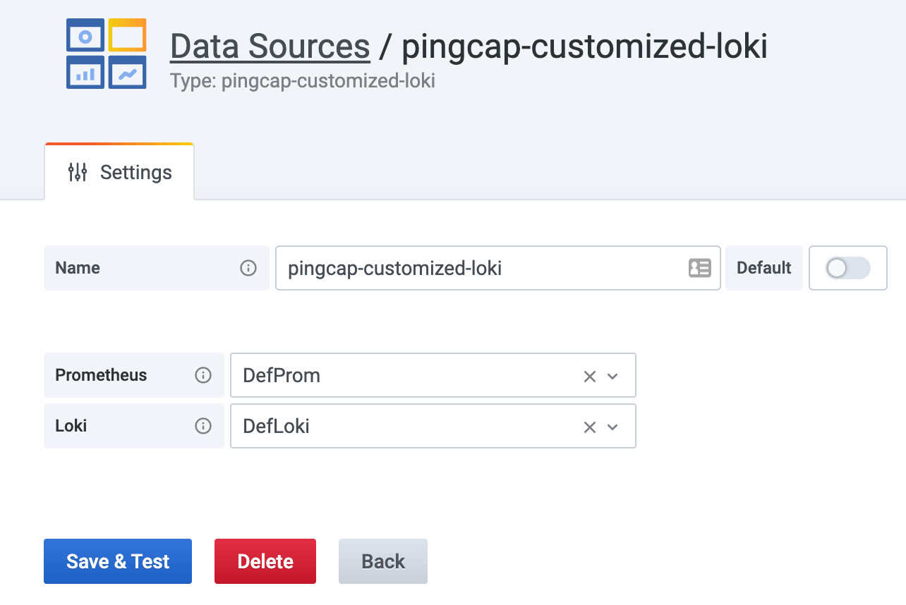

# PingCAP Customized Loki DataSource Plugin

A grafana datasource plugin that enhances the power of the Loki Explore.

> Note: this plugin is only used internal.

## Demo

> The screenshots come from the dev environment.

Config when adding datasource:



Usage:


Help:


## Getting Started

### Build

1. Clone repo to the grafana plugins folder (assume it is in `~/grafana-plugins`)

   ```bash
   cd ~/grafana-plugins
   git clone git@github.com:baurine/customized-loki-ds-plugin.git
   cd customized-loki-ds-plugin
   ```

1. Install dependencies

   ```bash
   yarn install
   ```

1. Build plugin in development mode or run in watch mode

   ```bash
   yarn dev
   ```

   or

   ```bash
   yarn watch
   ```

1. Build plugin in production mode

   ```bash
   yarn build
   ```

### Run in grafana

1. Start the grafana by docker, mount the grafana-plugins folder.

   ```bash
   docker run -d -p 3000:3000 -v ~/grafana-plugins:/var/lib/grafana/plugins --name=grafana grafana/grafana:7.4.0
   ```

   If need to restart the container, run:

   ```bash
   docker restart grafana
   ```

1. Forward the prometheus and loki services that run in the k8s.

   ```bash
   kubectl port-forward svc/thanos-query 9090:9090 -n monitoring
   kubectl port-forward svc/loki 3100:3100 -n logging
   ```

1. Add prometheus datasource, assign its name `DefProm` and URl `host.docker.internal:9090`.

1. Add loki datasource, assign its name `DefLoki` and URL `host.docker.internal:3100`.

1. Add pingcap-customized-loki datasource (our plugin), assign its Prometheus datasource `DefProm` and Loki datasource `DefLoki`.

   

1. Enter the Explore page and select `pingcap-customized-loki`, enjoy it!

   
