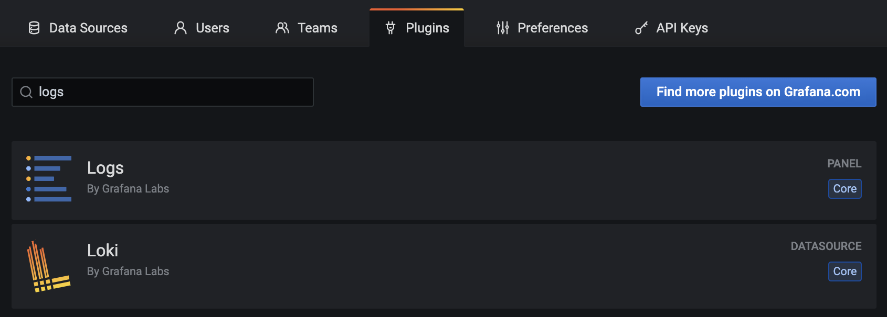
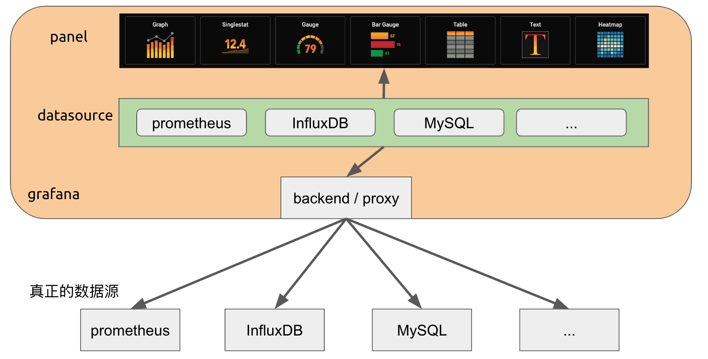
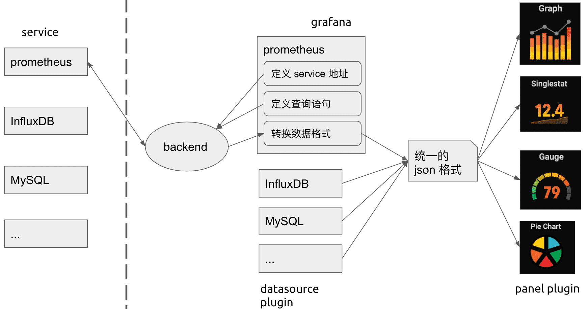
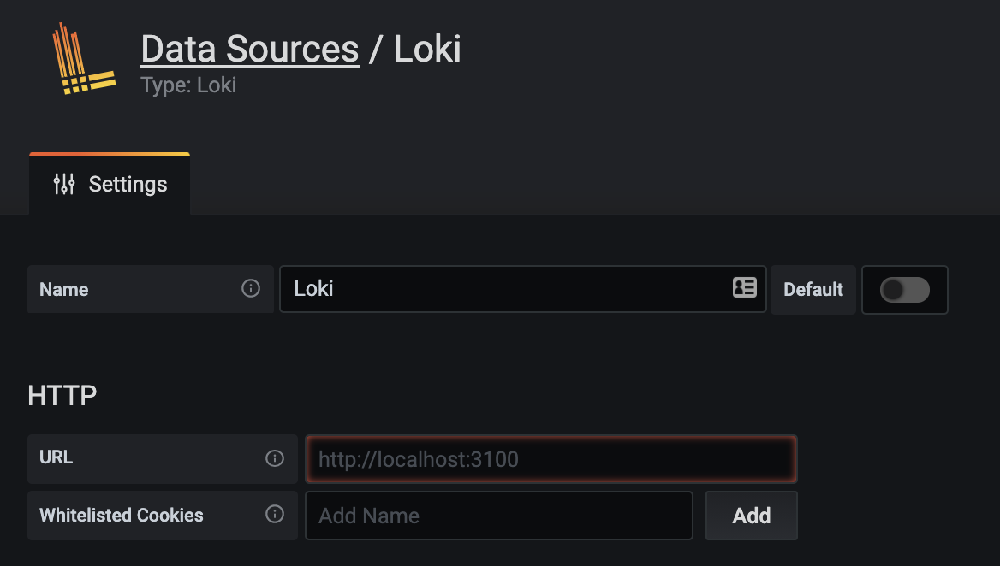
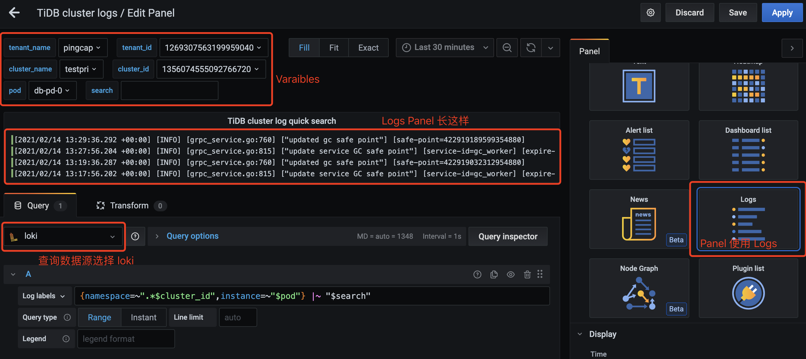
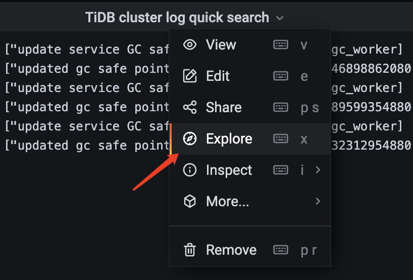
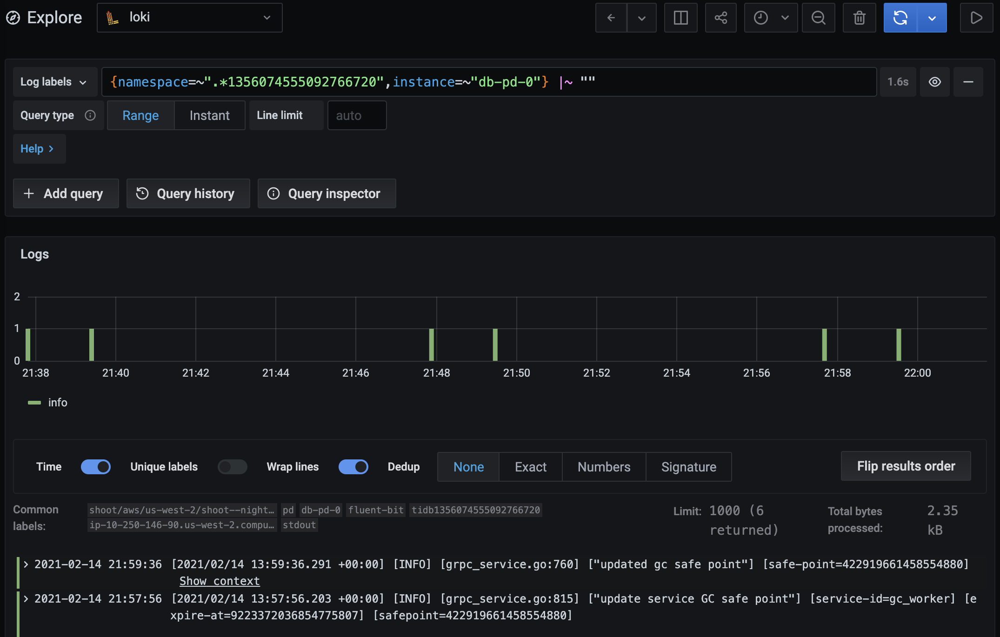
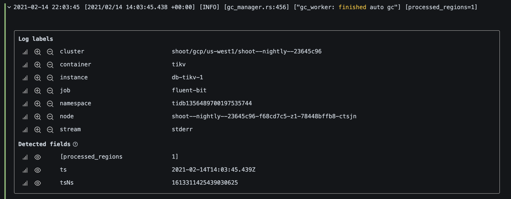
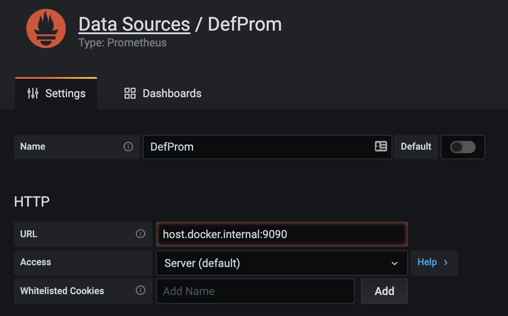
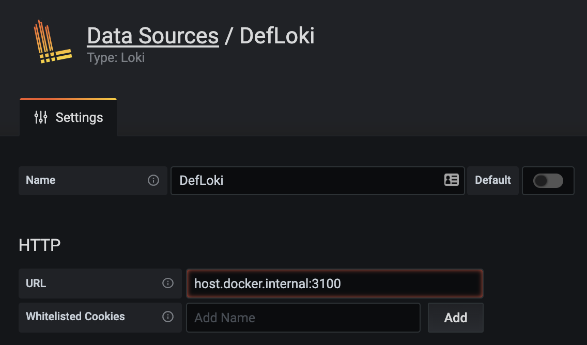

# 增强 Grafana Loki Data Source Plugin

(先暂时简单的记个流水账)

## 背景介绍

[Loki](https://grafana.com/oss/loki/) 是 Grafana 团队开发的一款水平可扩展，高可用性，多租户的日志聚合系统。它从 Prometheus 受到启发，"Like Prometheus, but for logs"，它不为日志内容编制索引，而是为每个日志流编制一组标签，因此经济高效且易于操作。

我们使用 Loki 将多个在 k8s 上布署的 TiDB 集群的日志进行统一收集，并使用 Grafana 来查询、搜索和显示收集的日志。

Grafana 为了支持对 Loki 日志的查询及显示，提供了两种插件：

1. Panel Plugin - Logs，用来显示日志
1. DataSource Plugin - Loki，用来从 Loki 服务中查询日志



在我的一篇旧文 - [如何开发一个 Grafana Panel Plugin](https://baurine.netlify.app/2019/11/14/how-make-a-grafana-panel-plugin/) 中解释了 Panel Plugin 和 DataSource Plugin 两种插件的区别。

Grafana 的插件有三种：

- DataSource: 数据的生产者。定义数据从何获处，如何获取，委托 Grafana 后端从实际数据源处获取原始数据后，将其转换成统一的格式，再由 Grafana 传递到 Panel 显示
- Panel: 数据的消费者。从 DataDource 处获得约定格式的数据进行展示
- App: DataSource + Panel





那在 Grafana 中我们如何使用 Loki 呢。

第一步，配置 Loki DataSource Plugin。在左侧齿轮图标 Configuration 中选择 "Data Sources"，点击 "Add data source"，选择 Loki，进入到配置页面，基本上只要填写 Loki 服务的 http 地址就行，比如如下所示：



第二步，创建 dashboard 的子看板 (即 Panel，但这里没有用 Panel 这个词是不想和后面的 Logs panel 混淆)，在看板的 Edit 界面，选择查询数据源为 Loki，定义查询表达式，并使用 Logs panel 来显示 logs。



为了方便切换查看不同集群的日志，我们添加了一些选择不同租户，不同集群的 variables。但这些 variables 并不是来自 loki，而是来自 prometheus。这也很好理解，因为对这些集群，我们使用 prometheus 收集 metrics，使用 loki 收集 logs。

但是，Logs panel 的功能非常有限，并不能很好地满足我们的日常需求，比如查看某条日志的前后几条相邻的日志，查看某条日志更多的标签。这时，我们不得不点击看板下的 "Explore" 按钮跳转到 Explore 页面。





Grafana 的 Explore 功能有点类似 playground，你可以输入任意查询表达式，来查询一些临时的结果。

对于查看日志来说，Explore 中的 Logs panel 功能就比较能满足我们的日常需求了，它可以查看一条日志更完整的详细信息，和前后相邻的几条日志。




但是，在 Explore 中的表达式几乎要自己手动输入，尤其是集群 id 是一串不可读的数字 id。

如果每次查询都要在两个页面间切换，这就很不用户体验了。

**于是我们想，能不能把这两者的优点结合起来呀，也就是说，可以在 Loki 的 Explore 页面中支持选择租户，选择集群，然后生成查询语句 (而不是完全自己手动输入) 进行查询。**

查看了一下 grafana 的开发文档，看到有说可以对 Explore 页面进行扩展的能力 - [Add support for Explore queries](https://grafana.com/docs/grafana/latest/developers/plugins/add-support-for-explore-queries/)，于是决定一试。

## 方案选择

仔细阅读了 [Add support for Explore queries](https://grafana.com/docs/grafana/latest/developers/plugins/add-support-for-explore-queries/) 这篇文章，原来 Explore 页面的一部分功能也是由 DataSource Plugin 实现的。

那很自然就想到，那我们就来修改 Loki DataSource Plugin 的代码呗，它的代码是开源的嘛。我们可以把它的代码从 grafana 中复制一份出来，然后修改成一个自己的版本。(具体目录是在 grafana repo 的 [public/app/plugins/datasource/loki](https://github.com/grafana/grafana/tree/8f691115bc/public/app/plugins/datasource/loki))

初步试了一下失败了，复制出来 build 不了。主要原因是因为这个 plugin 是 grafana 内置的，所以没有完全解耦，它直接调用了 grafana 本身的一些代码，甚至是 prometheus datasource plugin 的一些代码。

```ts
// https://github.com/grafana/grafana/blob/8f691115bc2be265932053686eacd5fec5cf21b5/public/app/plugins/datasource/loki/datasource.ts#L29-L31

import { addLabelToQuery } from 'app/plugins/datasource/prometheus/add_label_to_query';
import { getTimeSrv, TimeSrv } from 'app/features/dashboard/services/TimeSrv';
import { convertToWebSocketUrl } from 'app/core/utils/explore';
```

此路不通甚至有点绝望。

继续看 grafana 的文档，看看能不能找出点什么线索。突然看到一个方法名：[getDataSourceSrv()](https://grafana.com/docs/grafana/latest/packages_api/runtime/getdatasourcesrv/)，大意是说可以和其它插件进行通信，再仔细看看，通过 DataSourceSrv 接口的 [get()](https://grafana.com/docs/grafana/latest/packages_api/runtime/datasourcesrv/#get-method) 方法，可以得到其它插件的实例，那岂不是可以直接调用其它插件的方法？

如果可行的话，那么我们就可以自己写一个很轻量的 DataSource plugin 了，这个 plugin 只负责在 Explore 页面支持选择租户，集群等信息，然后生成查询表达式，接着直接调用 Loki 插件的查询方法来获取日志结果。而且，甚至获取租户列表，集群列表这些信息我们也不需要手动实现，可以直接调用 promethues 插件的方法来得到。

简单验证了一下，可路可行，而且简单多了。

## 开发过程

### 阅读官方 tutorial

[Build a data source plugin](https://grafana.com/tutorials/build-a-data-source-plugin/#1)

我的个人习惯，先照着官方教程完整走一遍流程。

### 环境搭建

照着上面的 tutorial，基本上就把环境搭建起来了，并能跑通一个简单的 data source plugin 了，我们接下来就在它的基础上进行修改。

我选择了使用 docker 把 grafana 跑起来，假设我的 grafana plugins 目录是 `/Users/baurine/Codes/Personal/grafana-plugins`。

```shell
docker run -d -p 3000:3000 -v /Users/baurine/Codes/Personal/grafana-plugins:/var/lib/grafana/plugins --name=grafana grafana/grafana:7.4.0
```

另外，因为我们的插件要调用 prometheus 和 loki 插件的方法，因此要先把 prometheus 和 loki 的服务也跑起来，这两个服务已经在云上的 k8s 上运行，我们在本地调试时需要在本地做一个端口转发，比如：

```
kubectl port-forward svc/thanos-query 9090:9090 -n monitoring
kubectl port-forward svc/loki 3100:3100 -n logging
```

因此，我们在本地访问 `http://localhost:9090` 和 `http://localhost:3100` 就相当于访问远端的 promethues 和 loki 了。

接下来，我们要在 grafana 中添加 prometheus 和 loki 两个 data source。这里会遇到一个小问题，我们是在 host 中做了端口转发，但 grafana 是运行在 docker 容器里的，在设置 prometheus data source 的 URL 时，如果我们填写 `http://localhost:9090` 那访问的会是 docker 容器的 9090 端口，而不是 host 的 9090 端口。怎么能在容器里访问到 host 呢，答案是将 localhost 改成 [`host.docker.internal`](https://stackoverflow.com/questions/24319662/from-inside-of-a-docker-container-how-do-i-connect-to-the-localhost-of-the-mach)。





### 