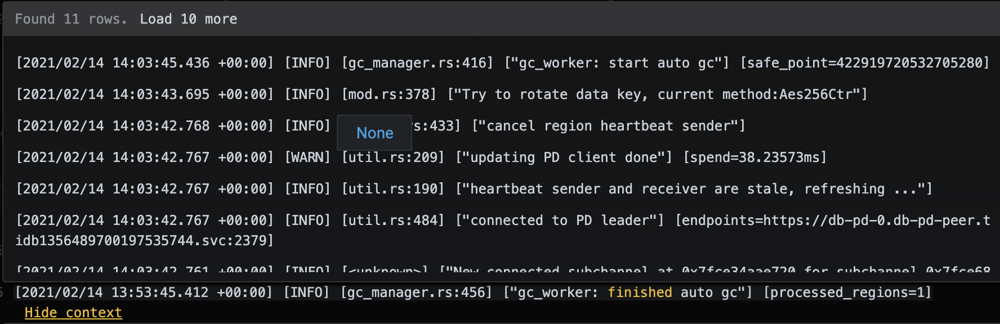

# 增强 Grafana Loki Data Source Plugin 的 Explore 功能

## 背景介绍

[Loki](https://grafana.com/oss/loki/) 是 Grafana 团队开发的一款水平可扩展，高可用性，多租户的日志聚合系统。它从 Prometheus 受到启发，"Like Prometheus, but for logs"，它不为日志内容编制索引，而是为每个日志流编制一组标签，因此经济高效且易于操作。

我们使用 Loki 将多个在 k8s 上布署的 TiDB 集群的日志进行统一收集，并使用 Grafana 来查询、搜索和显示收集的日志。

Grafana 为了支持对 Loki 日志的查询及显示，提供了两种插件：

1. DataSource Plugin - Loki，用来从 Loki 服务中查询日志
1. Panel Plugin - Logs，用来显示日志


在我的一篇旧文 - [如何开发一个 Grafana Panel Plugin](https://baurine.netlify.app/2019/11/14/how-make-a-grafana-panel-plugin/) 中解释了 Panel Plugin 和 DataSource Plugin 两种插件的区别。

Grafana 的插件有三种：

- DataSource: 数据的生产者。定义数据从何获处，如何获取，委托 Grafana 后端从实际数据源处获取原始数据后，将其转换成统一的格式，再由 Grafana 传递到 Panel 显示
- Panel: 数据的消费者。从 DataDource 处获得约定格式的数据进行展示
- App: DataSource + Panel


那在 Grafana 中我们如何使用 Loki 呢。

第一步，配置 Loki DataSource Plugin。在左侧齿轮图标 Configuration 中选择 "Data Sources"，点击 "Add data source"，选择 Loki，进入到配置页面，基本上只要填写 Loki 服务的 http 地址就行，比如如下所示：


第二步，创建 dashboard 的子看板 (即 Panel，但这里没有用 Panel 这个词是不想和后面的 Logs panel 混淆)，在看板的 Edit 界面，选择查询数据源为 Loki，定义查询表达式，并使用 Logs panel 来显示 logs。


(_谌误：图中 Varaibles 应为 Variables_)

为了方便切换查看不同集群的日志，我们添加了一些选择不同租户，不同集群的 Variables。但这些 Variables 并不是来自 Loki，而是来自 Prometheus。这也很好理解，因为对这些集群，我们使用 Prometheus 收集 metrics，使用 Loki 收集 logs。

但是，此处的 Logs panel 的功能非常有限，并不能很好地满足我们的日常需求，比如查看某条日志的前后几条相邻的日志，查看某条日志更多的标签。这时，我们不得不点击看板下的 "Explore" 按钮跳转到 Explore 页面。


Grafana 的 Explore 功能有点类似 playground，你可以输入任意查询表达式，来查询一些临时的结果。

对于查看日志来说，Explore 中的 Logs panel 功能就比较能满足我们的日常需求了，它可以查看一条日志更完整的详细信息，和前后相邻的几条日志。




但是，在 Explore 中的表达式几乎要自己手动输入，尤其是集群 id 是一串不可读的数字 id。

如果每次查询都要在两个页面间切换，这就很不用户体验了。

**于是我们想，能不能把这两者的优点结合起来呀，也就是说，可以在 Loki 的 Explore 页面中支持选择租户，选择集群，然后生成查询语句 (而不是完全自己手动输入) 进行查询。**

查看了一下 Grafana 的开发文档，看到有说可以对 Explore 页面进行扩展的能力 - [Add support for Explore queries](https://grafana.com/docs/grafana/latest/developers/plugins/add-support-for-explore-queries/)，于是决定一试。

## 方案选择

仔细阅读了 [Add support for Explore queries](https://grafana.com/docs/grafana/latest/developers/plugins/add-support-for-explore-queries/) 这篇文章，原来 Explore 页面的一部分功能也是由 DataSource Plugin 实现的。

那很自然就想到，那我们就来修改 Loki DataSource Plugin 的代码呗，它的代码是开源的嘛。我们可以把它的代码从 grafana 中复制一份出来，然后修改成一个自己的版本。(具体目录是在 grafana repo 的 [public/app/plugins/datasource/loki](https://github.com/grafana/grafana/tree/8f691115bc/public/app/plugins/datasource/loki))

初步试了一下失败了，复制出来 build 不了。主要原因是因为这个 plugin 是 Grafana 内置的，所以没有完全解耦，它直接调用了 Grafana 本身的一些代码，甚至是 Prometheus datasource plugin 的一些代码。

```ts
// https://github.com/grafana/grafana/blob/8f691115bc2be265932053686eacd5fec5cf21b5/public/app/plugins/datasource/loki/datasource.ts#L29-L31

import { addLabelToQuery } from 'app/plugins/datasource/prometheus/add_label_to_query';
import { getTimeSrv, TimeSrv } from 'app/features/dashboard/services/TimeSrv';
import { convertToWebSocketUrl } from 'app/core/utils/explore';
```

此路不通甚至有点绝望。

继续看 Grafana 的文档，看看能不能找出点什么线索。突然看到一个方法名：[getDataSourceSrv()](https://grafana.com/docs/grafana/latest/packages_api/runtime/getdatasourcesrv/)，大意是说可以和其它插件进行通信，再仔细看看，通过 DataSourceSrv 接口的 [get()](https://grafana.com/docs/grafana/latest/packages_api/runtime/datasourcesrv/#get-method) 方法，可以得到其它插件的实例，那岂不是可以直接调用其它插件的方法？

如果可行的话，那么我们就可以自己写一个很轻量的 DataSource plugin 了，这个 plugin 只负责在 Explore 页面支持选择租户，集群等信息，然后生成查询表达式，接着直接调用 Loki 插件的查询方法来获取日志结果。而且，甚至获取租户列表，集群列表这些信息我们也不需要手动实现，可以直接调用 Promethues 插件的方法来得到。

简单验证了一下，可路可行，而且简单多了。

## 开发过程

### 阅读官方 tutorial

[Build a data source plugin](https://grafana.com/tutorials/build-a-data-source-plugin/#1)

我的个人习惯，先照着官方教程完整走一遍流程。

### 环境搭建

照着上面的 tutorial，基本上就把环境搭建起来了，并能跑通一个简单的示例 data source plugin 了，我们接下来就在它的基础上进行修改。

我选择了使用 docker 把 Grafana 跑起来，假设我的 Grafana plugins 目录是 `/Users/baurine/Codes/Personal/grafana-plugins`。

```shell
docker run -d -p 3000:3000 -v /Users/baurine/Codes/Personal/grafana-plugins:/var/lib/grafana/plugins --name=grafana grafana/grafana:7.4.0
```

另外，因为我们的插件要调用 Prometheus 和 Loki 插件的方法，因此要先把 Prometheus 和 Loki 的服务也跑起来，这两个服务已经在云上的 k8s 上运行，我们在本地调试时需要在本地做一个端口转发，比如：

```
kubectl port-forward svc/thanos-query 9090:9090 -n monitoring
kubectl port-forward svc/loki 3100:3100 -n logging
```

因此，我们在本地访问 `http://localhost:9090` 和 `http://localhost:3100` 就相当于访问远端的 Promethues 和 Loki 了。

接下来，我们要在 Grafana 中添加 Prometheus 和 Loki 两个 data source。这里会遇到一个小问题，我们是在 host 中做了端口转发，但 Grafana 是运行在 docker 容器里的，在设置 Prometheus data source 的 URL 时，如果我们填写 `http://localhost:9090` 那访问的会是 docker 容器的 9090 端口，而不是 host 的 9090 端口。怎么能在容器里访问到 host 呢，答案是将 localhost 改成 `host.docker.internal` ([stackoverflow answer](https://stackoverflow.com/questions/24319662/from-inside-of-a-docker-container-how-do-i-connect-to-the-localhost-of-the-mach))。


### 实现 query() 方法

从 tutorial 里得知，实现 data source plugin，最关键是要实现 DataSourceApi 接口的 `query()` 方法。它负责从真实的服务请求数据 (实际是委托 grafana 去请求)，然后将结果转换成 grafana 约定的格式 (即 DataFrame)。这些复杂的工作都已经由 Loki data source plugin 完成了，我们的 `query()` 方法只需要简单地转发给 Loki 插件去处理。具体代码如下：

```ts
// src/datasource.ts
export class DataSource extends DataSourceApi<MyQuery, MyDataSourceOptions> {
  lokiDS: DataSourceApi | null = null;
  // ...
  query(options: DataQueryRequest<MyQuery>): Promise<DataQueryResponse> | Observable<DataQueryResponse> {
    if (this.lokiDS === null) {
      return of({
        data: [],
        state: LoadingState.Done,
      });
    }
    return this.lokiDS.query(options);
  }
}
```

注意，`query()` 方法的参数是 `DataQueryRequest<TQuery>` 类型的对象，对于 Loki data source plugin，通过查看它的源码得知，它的 `query()` 方法的参数是 `DataQueryRequest<LokiQuery>` 类型。

LokiQuery 定义如下：

```ts
// https://github.com/grafana/grafana/blob/8f691115bc2be265932053686eacd5fec5cf21b5/public/app/plugins/datasource/loki/types.ts#L25-L35
export interface LokiQuery extends DataQuery {
  expr: string;
  query?: string;
  format?: string;
  reverse?: boolean;
  legendFormat?: string;
  valueWithRefId?: boolean;
  maxLines?: number;
  range?: boolean;
  instant?: boolean;
}
```

这里面最重要的字段是 expr，是查询表达式字符串，其它属性可以先忽略，因此我们把 MyQuery 类型的定义改成和 LokiQuery 匹配：

```ts
// src/types.ts
export interface MyQuery extends DataQuery {
  expr: string; // keep same as the loki data source
}
```

接下来的问题就是我们怎么来拿到这个 `this.lokiDS`，即 Loki data source plugin 的实例了。

根据文档，我们可以用 `getDataSourceSrv().get(dataSourceName)` 来拿到其它的 data source 实例，比如上面我们添加 loki data source 时填定的 name 是 `DefLoki`，那就可以通过 `getDataSourceSrv().get("DefLoki")` 来获取。

但是，我们不能 hard code，而且 data source 的 name 也是可以被修改的。所以问题转换成，怎么动态拿到 Loki data source 的 name 呢？

这个问题，我们可以通过 ConfigEditor 来解决。我们让用户在添加该 data source，指定所要使用的 Loki data source，我们记下它的 uid (data source 的 name 可以修改，但 uid 不会变)，这个值会被 Grafana 持久化。之后我们再用 uid 获取对应 data source 的 name，再通过 name 来获取 data source 的实例。(疑惑，为啥 Grafana 没有提供通过 uid 直接拿到 data source 实例的方法呢？)

另外，我们后面还需要获取 Prometheus data source 的实例，所以，我们在 ConfigEditor 中也让用户指定 Prometheus data source。

最终效果如下：


### 实现 ConfigEditor

ConfigEditor 是用来给用户在添加 data source 进行配置的组件，比如设置服务源的 URL。

对于我们这个 plugin，我们所要做的就是在 Config 界面，获取用户所有添加的 data source，供用户选择目标 Prometheus 和 Loki data source。

Config 的选项值会被 grafana 保存在 MyDataSourceOptions 对象中，修改它的定义：

```ts
// src/types.ts
export interface MyDataSourceOptions extends DataSourceJsonData {
  promDataSourceUid: string;
  lokiDataSourceUid: string;
}
```

然后在 ConfigEditor 组件中，获取 data source 列表 (使用 `DataSourceSrv.getList()` 方法)，用 Select 组件供用户选择：

```tsx
// src/ConfigEditor.tsx
interface Props extends DataSourcePluginOptionsEditorProps<MyDataSourceOptions> {}

export function ConfigEditor(props: Props) {
  const [dsList, setDsList] = useState<SelectableValue[]>([]);
  const {
    options: {
      id: selfId, // plugin self id
      jsonData: { promDataSourceUid, lokiDataSourceUid },
    },
  } = props;

  useEffect(() => {
    const dsSrv = getDataSourceSrv();
    const allDS = dsSrv.getList();
    const dsList: SelectableValue[] = allDS
      .filter(ds => ds.uid !== undefined && ds.id !== selfId)
      .map(ds => ({
        label: ds.name,
        value: ds.uid,
      }));
    setDsList(dsList);
  }, [selfId]);

  const onPromDSChange = (v: SelectableValue) => {
    const { onOptionsChange, options } = props;
    const jsonData = {
      ...options.jsonData,
      promDataSourceUid: v?.value || '',
    };
    onOptionsChange({ ...options, jsonData });
  };

  const onLokiDSChange = (v: SelectableValue) => {
    const { onOptionsChange, options } = props;
    const jsonData = {
      ...options.jsonData,
      lokiDataSourceUid: v?.value || '',
    };
    onOptionsChange({ ...options, jsonData });
  };

  return (
    <div className="gf-form-group">
      <div className="gf-form">
        <InlineLabel width={16} tooltip="Select a Prometheus DataSource">
          Prometheus
        </InlineLabel>
        <Select isClearable={true} options={dsList} value={promDataSourceUid} onChange={onPromDSChange} width={36} />
      </div>

      <div className="gf-form">
        <InlineLabel width={16} tooltip="Select a Loki DataSource">
          Loki
        </InlineLabel>
        <Select isClearable={true} options={dsList} value={lokiDataSourceUid} onChange={onLokiDSChange} width={36} />
      </div>
    </div>
  );
}
```

当用户在 Config 界面点击 "Save & Test" 按钮时，它会调用 DataSourceApi 的 `testDataSource()` 方法，我们需要来实现这个方法。也很简单，先判断相应的值为不为空，如果不为空，则找到对应的 data source 实例，调用各实例的 `testDataSource()` 方法即可。

```ts
// src/datasource.ts
export class DataSource extends DataSourceApi<MyQuery, MyDataSourceOptions> {
  // ...
  async testDatasource() {
    const {
      jsonData: { lokiDataSourceUid, promDataSourceUid },
    } = this.instanceSettings;

    if (!promDataSourceUid) {
      throw new Error('Promethues datasource is empty!');
    }
    if (!lokiDataSourceUid) {
      throw new Error('Loki datasource is empty!');
    }

    const dataSourceSrv = getDataSourceSrv();
    const promDsSetting = dataSourceSrv.getInstanceSettings(promDataSourceUid);
    if (!promDsSetting) {
      throw new Error(`Target promethues datasource doesn't exist anymore !`);
    }
    const lokiDsSetting = dataSourceSrv.getInstanceSettings(lokiDataSourceUid);
    if (!lokiDsSetting) {
      throw new Error(`Target loki datasource doesn't exist anymore !`);
    }

    const promDs = await dataSourceSrv.get(promDsSetting.name);
    this.promDS = promDs as any;
    const promRes = await promDs.testDatasource();
    if (promRes.status === 'error') {
      return promRes;
    }

    const lokiDs = await dataSourceSrv.get(lokiDsSetting.name);
    this.lokiDS = lokiDs as any;
    const lokiRes = await lokiDs.testDatasource();
    if (lokiRes.status === 'error') {
      return lokiRes;
    }

    return {
      status: 'success',
      message: 'Both prometheus and loki data source are working',
    };
  }
}
```

最后，我们就可以来扩展 Loki 的 Explore 页面功能了。

在 Loki 自己实现的 Explore 界面上，仅提供了选择 Log labels 和手动输入查询表达式的功能，如下所示：


我们需要实现成可以选择租户，集群等信息，如下所示：


### 实现 ExploreQueryEditor

上述扩展可以通过自定义 ExploreQueryEditor 实现。这里的核心在于如何获取租户信息列表，集群信息列表等信息。

这些信息的获取跟看板上 Variables 的获取逻辑是相似的。

这些 Variables 是通过 Prometheus 取回来的，通过分析得知，是请求了 Prometheus 的 `/series?match[]=xxx` 接口。我们也可以手动构造这些请求，但通过查阅了 Grafana 的文档 ([Add support for query variables to your data source](https://grafana.com/docs/grafana/latest/developers/plugins/add-support-for-variables/#add-support-for-query-variables-to-your-data-source)) 得知，有更简单的办法，Grafana 将获取 Variables 的逻辑抽象成了 `metricFindQuery()` 方法。因此我们只要调用 Prometheus data source 的 `metricFindQuery()` 方法即可。

以获取租户列表为例：

```tsx
// src/ExploreQueryEditor.tsx
useEffect(() => {
  async function queryTenants() {
    const promDS = await datasource.getPromDS();
    const tenantsRes = await promDS.metricFindQuery!('dbaas_tenant_info{status="active"}');
    const tenaneIdSet = new Set<string>();
    const tenantOptions: SelectableValue[] = [];
    tenantsRes.forEach(res => {
      const m = res.text.match(/.*name="([^"]*).*,tenant="([^"]*).*/);
      if (m) {
        const tenantName = m[1];
        const tenantId = m[2];
        if (!tenaneIdSet.has(tenantId)) {
          tenaneIdSet.add(tenantId);
          tenantOptions.push({ value: tenantId, label: tenantName, description: tenantId });
        }
      }
    });
    tenantOptions.sort((a, b) => {
      if (a.label! > b.label!) {
        return 1;
      } else if (a.label === b.label) {
        return a.value > b.value ? 1 : -1;
      } else {
        return -1;
      }
    });
    setTenantOptions(tenantOptions);
    if (tenantOptions.length > 0) {
      setSelectedTenant(tenantOptions[0]);
    }
  }
  try {
    setLoadingTenant(true);
    await queryTenants();
  } catch (err) {
    console.log(err);
  } finally {
    setLoadingTenant(false);
  }
}, [datasource]);
```

显示效果如下：


### 实现 `Show context`
